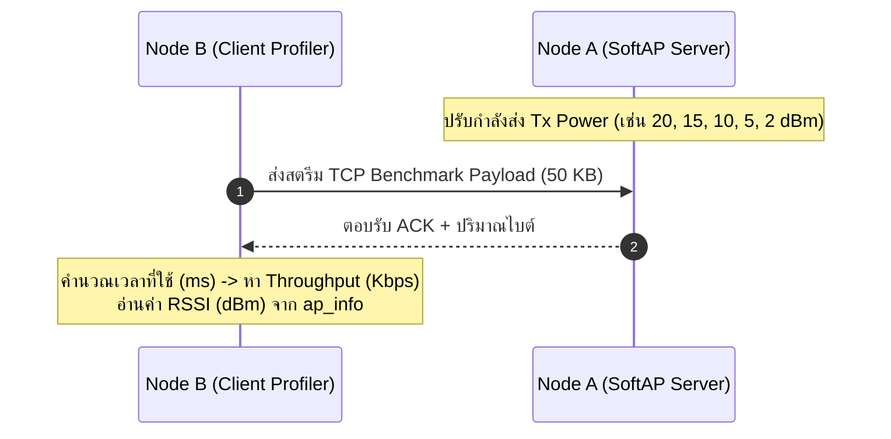
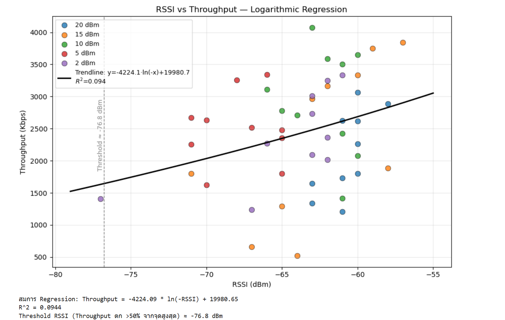

# ใบงานที่ 6.2: การประเมินความสัมพันธ์ RSSI vs Throughput ด้วย Software Tx-Power Control (Pair Work 👥)

## 0. กล่าวนำ (Introduction)
ใบงานนี้ออกแบบมาให้นักศึกษาจับคู่ 2 คน (**Node A: ESP32 SoftAP Server** และ **Node B: ESP32 Station Client**) เพื่อร่วมกันทดลองวัดและวิเคราะห์ประสิทธิภาพการรับส่งข้อมูลจริงระดับเครือข่ายไร้สาย (Throughput Speed Profiling) 

นักศึกษาจะได้ทดลองควบคุมระดับกำลังส่งสัญญาณวิทยุด้วยคำสั่ง `esp_wifi_set_max_tx_power()` ร่วมกับการปรับระยะห่างในห้องเรียน บันทึกค่าความแรงสัญญาณ **RSSI (dBm)** คู่กับความเร็ว **Throughput (Kbps)** และนำชุดข้อมูลที่ได้ไปพล็อต **Scatter Plot** เพื่อสร้างสมการถดถอย **(Regression Analysis)** ประเมินพฤติกรรมความเร็วของระบบ Wi-Fi

---

## 1. วัตถุประสงค์ (Objectives)
1. สามารถปรับกำลังส่งคลื่นวิทยุของ ESP32 ด้วยฟังก์ชัน `esp_wifi_set_max_tx_power()` ได้
2. คำนวณความเร็วระดับเครือข่าย (Throughput in Kbps) และค่าเวลาหน่วง (Latency in ms) ได้ถูกต้อง
3. สังเกตและวิเคราะห์ผลกระทบของระดับ RSSI (dBm) ที่มีต่อความเร็วและอัตราแพ็กเกจหล่นหาย (Packet Loss)
4. นำผลลัพธ์จากการทดลองไปสร้างแผนภาพ Scatter Plot และวิเคราะห์สมการถดถอย (Regression Analysis)

---

## 2. อุปกรณ์ที่ใช้ในการทดลอง (Equipment)
1. บอร์ด ESP32 จำนวน 2 บอร์ด (Node A ทำหน้าที่ AP / Node B ทำหน้าที่ Client Profiler)
2. สายเชื่อมต่อ USB จำนวน 2 เส้น
3. คอมพิวเตอร์สำหรับรันโปรแกรมและวิเคราะห์ข้อมูลสถิติ (Excel / Python)

---

## 3. ขั้นตอนการทดลอง (Experimental Procedures)



### ขั้นตอนการทดสอบ 5 ระดับกำลังส่ง (Software Attenuation Test):
1. **Node A (Server)**: รันโปรแกรมตั้งเป็น SoftAP และคอยรับ TCP Benchmark Connection
2. **Node B (Client)**: รันโปรแกรม Client Profiler คอยส่งชุดข้อมูลขนาด 50 KB จำนวน 10 รอบ
3. **การทดลองที่ 1**: กำหนด Tx Power = **20 dBm** (`esp_wifi_set_max_tx_power(80)`) -> อ่าน RSSI และบันทึก Throughput (Kbps)
4. **การทดลองที่ 2**: กำหนด Tx Power = **15 dBm** (`esp_wifi_set_max_tx_power(60)`) -> อ่าน RSSI และบันทึก Throughput
5. **การทดลองที่ 3**: กำหนด Tx Power = **10 dBm** (`esp_wifi_set_max_tx_power(40)`) -> อ่าน RSSI และบันทึก Throughput
6. **การทดลองที่ 4**: กำหนด Tx Power = **5 dBm** (`esp_wifi_set_max_tx_power(20)`) -> อ่าน RSSI และบันทึก Throughput
7. **การทดลองที่ 5**: กำหนด Tx Power = **2 dBm** (`esp_wifi_set_max_tx_power(8)`) -> อ่าน RSSI และบันทึก Throughput

---

## 4. ซอร์สโค้ดการทดลอง (Node B: Client Profiler - `main.c`)

ดูใน  Lab6-2-RSSI-Speed-Profiler\main\main.c

---

## 5. ตารางบันทึกผลการทดลอง (Experiment Results)

| การทดลองที่ | ค่า Tx Power ที่ตั้ง (dBm) | ค่า RSSI ที่อ่านได้จริง (dBm) | เวลาที่ใช้ (Seconds) | ความเร็วที่วัดได้ Throughput (Kbps) |
| :---: | :---: | :---: | :---: | :---: |
| **1** | 20 dBm (Max) | -60.7 | 0.213 | 2117.65 |
| **2** | 15 dBm | -62.6 | 0.277 | 2322.54 |
| **3** | 10 dBm | -62.3 | 0.153 | 2932.23 |
| **4** | 5 dBm | -67.8 | 0.172 | 2493.11 |
| **5** | 2 dBm (Min) | -64.6 | 0.191 | 2372.40 |
---

## 6. งานวิเคราะห์ข้อมูลเชิงสถิติ (Data Science & Regression Task)

ให้นักศึกษานำค่า **RSSI (x-axis)** และ **Throughput (y-axis)** จากตารางทดลองไปสร้างแผนภาพใน Excel หรือ Python (Jupyter Notebook):

1. สร้างแผนภาพ **Scatter Plot** แสดงจุดข้อมูลระหว่าง RSSI กับ Speed
2. สร้างเส้นแนวโน้ม **Trendline / Regression Curve** (เช่น Logarithmic Regression: $y = a \cdot \ln(x) + b$)
3. คำนวณค่า **$R^2$ (Coefficient of Determination)** เพื่อประเมินความแม่นยำของสมการ
4. ระบุจุด **Threshold RSSI (dBm)** ที่ความเร็วเริ่มลดลงมากกว่า 50% จากระดับสูงสุด

---

## 7. คำถามท้ายการทดลอง (Post-Lab Questions)

1. เมื่อลดระดับ Tx Power ลงจาก 20 dBm เหลือ 2 dBm ค่า RSSI ลดลงกี่ dBm และส่งผลต่อความเร็ว Throughput อย่างไร?**

จากค่าที่วัดได้จริง RSSI ลดลงจาก **-60.7 dBm** (20 dBm) เหลือ **-64.6 dBm** (2 dBm) คือลดลงประมาณ **3.9 dBm** เท่านั้น ซึ่งน้อยกว่าที่คาดตามทฤษฎีมาก (ทฤษฎีควรลดประมาณ 14.5 dBm ตามส่วนต่างของ Tx Power จริงที่วัดได้ 15.0→0.5 dBm) เหตุผลคือระยะห่างระหว่างบอร์ดในการทดลองนี้สั้น (อยู่ในห้องเดียวกัน) ทำให้แม้ลดกำลังส่งไปมาก สัญญาณก็ยังแรงพอสำหรับ WPA2 handshake และการรับส่งข้อมูลได้เกือบปกติ

ส่วน Throughput ไม่ได้ลดลงตามสัดส่วนของ RSSI อย่างชัดเจน (2117→2322→2932→2493→2372 Kbps) เพราะ RSSI ทุกระดับยังอยู่ในช่วง -58 ถึง -71 dBm ซึ่งเป็นช่วงที่ TCP/Wi-Fi ยังทำงานได้เต็มประสิทธิภาพ (ไม่ต่ำกว่าธรณีขีดที่ทำให้เกิด packet loss มาก) ความแกว่งของ Throughput ที่เห็นจึงมาจาก noise ของสภาพแวดล้อมและการแกว่งของ RSSI ระหว่างรอบมากกว่าผลของ Tx Power โดยตรง

2. เหตุใดในระดับ RSSI ที่อ่อนกว่า `-80 dBm` ความเร็ว Throughput ถึงตกลงอย่างกะทันหันในโปรโตคอล TCP?**

เมื่อ RSSI อ่อนกว่า -80 dBm สัญญาณจะเข้าใกล้ noise floor ของตัวรับ ทำให้ Bit Error Rate (BER) ในชั้น PHY สูงขึ้นอย่างรวดเร็ว ส่งผลต่อเนื่องเป็นลำดับดังนี้:

- **Physical layer**: เฟรมข้อมูลเสียหายบ่อยขึ้น ทำให้ driver ต้อง**ลด modulation/coding rate** (เช่นจาก 64-QAM ลงมาเป็น BPSK) เพื่อรักษาความน่าเชื่อถือ ซึ่งลด raw bitrate ลงมาก
- **MAC layer**: เฟรมที่เสียหายต้องมีการ**retransmit** ซ้ำหลายครั้ง เพิ่ม latency และลด effective throughput
- **TCP layer**: TCP ตีความ packet loss/delay ที่มากขึ้นว่าเป็นสัญญาณของ network congestion จึงสั่ง**ลด Congestion Window (cwnd)** ลง ทำให้ส่งข้อมูลได้ทีละน้อยลงเรื่อยๆ ยิ่งซ้ำเติมปัญหา

ผลรวมคือ Throughput ไม่ได้ลดลงแบบเส้นตรงตาม RSSI แต่ "ตกหน้าผา" (cliff effect) เมื่อข้าม threshold ที่สัญญาณเริ่มไม่น่าเชื่อถือพอ

3. สมการ Regression ที่ได้จากการทดลองสามารถนำไปประยุกต์ใช้ทำนายคุณภาพการเชื่อมต่อในแอปพลิเคชัน IoT ได้อย่างไร?**

สมการ Logarithmic Regression ที่ได้ (y = a·ln(x) + b) สามารถนำไปใช้เป็น **model เชิงคาดการณ์ (predictive model)** ในระบบ IoT ได้หลายรูปแบบ เช่น:

- **Adaptive data rate control**: อุปกรณ์ IoT อ่านค่า RSSI ปัจจุบันแล้วใช้สมการทำนาย Throughput ที่คาดว่าจะได้ ก่อนตัดสินใจว่าจะส่งข้อมูลขนาดใหญ่ (เช่น firmware update, image capture) หรือรอสัญญาณดีขึ้นก่อน
- **Node placement planning**: ใช้สมการช่วยกำหนดตำแหน่งติดตั้ง Gateway/AP ในพื้นที่ให้ทุกโหนดมี RSSI สูงพอเกิน Throughput ขั้นต่ำที่แอปพลิเคชันต้องการ
- **Early warning / fallback mechanism**: ระบบตรวจสอบ RSSI แบบ real-time เทียบกับ Threshold ที่หาได้จากข้อ 6.4 หาก RSSI ใกล้ threshold ให้ระบบสลับไปใช้โปรโตคอลสำรองที่ทนทานกว่า (เช่น LoRa) หรือลดขนาด payload ลง

ข้อควรระวัง: สมการนี้ fit ได้เฉพาะกับสภาพแวดล้อมและระยะทดลองที่เก็บข้อมูลจริง (ห้องเดียวกัน, สิ่งกีดขวางแบบเดิม) หากนำไปใช้ต่างสภาพแวดล้อม (outdoor, มีสิ่งกีดขวางต่างชนิด) ควรเก็บข้อมูลและ fit สมการใหม่ เนื่องจาก path loss model จะเปลี่ยนไปตามสภาพแวดล้อม


---

ตัวอย่าง output log ฝั่ง AP

```
rst:0x1 (POWERON_RESET),boot:0x13 (SPI_FAST_FLASH_BOOT)
configsip: 0, SPIWP:0xee
clk_drv:0x00,q_drv:0x00,d_drv:0x00,cs0_drv:0x00,hd_drv:0x00,wp_drv:0x00
mode:DIO, clock div:2
load:0x3fff0040,len:6272
load:0x40078000,len:15824
load:0x40080400,len:3988
--- 0x40080400: _invalid_pc_placeholder at C:/Users/koson/esp/v5.5.1/esp-idf/components/xtensa/xtensa_vectors.S:2235
entry 0x40080644
--- 0x40080644: call_start_cpu0 at C:/Users/koson/esp/v5.5.1/esp-idf/components/bootloader/subproject/main/bootloader_start.c:28
I (27) boot: ESP-IDF v6.1-beta1-685-g6a9c44fe7e7 2nd stage bootloader
I (27) boot: compile time Aug  9 2026 16:16:02
I (28) boot: Multicore bootloader
I (31) boot: chip revision: v3.0
I (33) boot.esp32: SPI Speed      : 40MHz
I (37) boot.esp32: SPI Mode       : DIO
I (41) boot.esp32: SPI Flash Size : 2MB
I (44) boot: Enabling RNG early entropy source...
I (49) boot: Partition Table:
I (51) boot: ## Label            Usage          Type ST Offset   Length
I (58) boot:  0 nvs              WiFi data        01 02 00009000 00006000
I (64) boot:  1 phy_init         RF data          01 01 0000f000 00001000
I (71) boot:  2 factory          factory app      00 00 00010000 00100000
I (77) boot: End of partition table
I (81) esp_image: segment 0: paddr=00010020 vaddr=3f400020 size=1b154h (110932) map
I (128) esp_image: segment 1: paddr=0002b17c vaddr=3ffb0000 size=04a0ch ( 18956) load
I (135) esp_image: segment 2: paddr=0002fb90 vaddr=40080000 size=00488h (  1160) load
I (136) esp_image: segment 3: paddr=00030020 vaddr=400d0020 size=8fa68h (588392) map
I (351) esp_image: segment 4: paddr=000bfa90 vaddr=40080488 size=17b5ch ( 97116) load
I (391) esp_image: segment 5: paddr=000d75f4 vaddr=50000000 size=00028h (    40) load
I (403) boot: Loaded app from partition at offset 0x10000
I (403) boot: Disabling RNG early entropy source...
I (414) cpu_start: Multicore app
I (422) cpu_start: GPIO 3 and 1 are used as console UART I/O pins
I (422) cpu_start: Pro cpu start user code
I (422) cpu_start: cpu freq: 160000000 Hz
I (424) app_init: Application information:
I (428) app_init: Project name:     wifi_softap_tracking
I (433) app_init: App version:      1
I (436) app_init: Compile time:     Aug  9 2026 16:16:41
I (441) app_init: ELF file SHA256:  c617ced60...
--- Warning: Checksum mismatch between flashed and built applications. Checksum of built application is 968d1fc34c0226e0c39f04a5ed8b482138f54cdf061866029782361dfd7bb4db
I (446) app_init: ESP-IDF:          v6.1-beta1-685-g6a9c44fe7e7
I (451) efuse_init: Min chip rev:     v0.0
I (455) efuse_init: Max chip rev:     v3.99
I (459) efuse_init: Chip rev:         v3.0
I (463) heap_init: Initializing. RAM available for dynamic allocation:
I (469) heap_init: At 3FFAE6E0 len 00001920 (6 KiB): DRAM
I (474) heap_init: At 3FFB9528 len 00026AD8 (154 KiB): DRAM
I (480) heap_init: At 3FFE0440 len 00003AE0 (14 KiB): D/IRAM
I (485) heap_init: At 3FFE4350 len 0001BCB0 (111 KiB): D/IRAM
I (490) heap_init: At 40097FE4 len 0000801C (32 KiB): IRAM
I (497) spi_flash: detected chip: generic
I (499) spi_flash: flash io: dio
W (502) spi_flash: Detected size(4096k) larger than the size in the binary image header(2048k). Using the size in the binary image header.
I (516) main_task: Started on CPU0
I (516) main_task: Calling app_main()
I (516) LAB_SOFTAP: [FORENSIC]: Call nvs_flash_init()
I (556) LAB_SOFTAP: [FORENSIC]: Call esp_netif_init()
I (556) LAB_SOFTAP: [FORENSIC]: Call esp_event_loop_create_default()
I (556) LAB_SOFTAP: [FORENSIC]: Call esp_netif_create_default_wifi_ap()
I (566) LAB_SOFTAP: [FORENSIC]: SoftAP Interface created at 0x3ffbf360 (Default IP: 192.168.4.1)
I (576) LAB_SOFTAP: [FORENSIC]: Call esp_wifi_init(&cfg)
I (586) wifi:wifi driver task: 3ffc1ae4, prio:23, stack:6656, core=0
I (606) wifi:wifi firmware version: e12a754
I (606) wifi:wifi certification version: v7.0
I (606) wifi:config NVS flash: enabled
I (606) wifi:config nano formatting: disabled
I (606) wifi:Init data frame dynamic rx buffer num: 32
I (616) wifi:Init static rx mgmt buffer num: 5
I (616) wifi:Init management short buffer num: 32
I (616) wifi:Init dynamic tx buffer num: 32
I (626) wifi:Init static rx buffer size: 1600
I (626) wifi:Init static rx buffer num: 10
I (636) wifi:Init dynamic rx buffer num: 32
I (636) wifi_init: rx ba win: 6
I (636) wifi_init: accept mbox: 6
I (646) wifi_init: tcpip mbox: 32
I (646) wifi_init: udp mbox: 6
I (646) wifi_init: tcp mbox: 6
I (646) wifi_init: tcp tx win: 5760
I (656) wifi_init: tcp rx win: 5760
I (656) wifi_init: tcp mss: 1440
I (656) wifi_init: WiFi IRAM OP enabled
I (666) wifi_init: WiFi RX IRAM OP enabled
I (666) LAB_SOFTAP: [FORENSIC]: Call esp_event_handler_instance_register(WIFI_EVENT)
I (676) LAB_SOFTAP: [FORENSIC]: Call esp_wifi_set_mode(WIFI_MODE_AP)
I (686) LAB_SOFTAP: [FORENSIC]: Call esp_wifi_set_config(WIFI_IF_AP, &wifi_config)
I (696) LAB_SOFTAP: [FORENSIC]: Call esp_wifi_start()
I (696) phy_init: phy_version 4863,a3a4459,Oct 28 2025,14:30:06
I (766) wifi:mode : softAP (94:b5:55:f2:60:0d)
I (776) wifi:Total power save buffer number: 16
I (776) wifi:Init max length of beacon: 752/752
I (776) wifi:Init max length of beacon: 752/752
I (776) LAB_SOFTAP: ==================================================================
I (786) esp_netif_lwip: DHCP server started on interface WIFI_AP_DEF with IP: 192.168.4.1
I (796) LAB_SOFTAP:   ESP32 SoftAP Running! SSID: "MY_ESP32_AP", Channel: 1
I (806) LAB_SOFTAP: ==================================================================
I (806) LAB_SOFTAP: [TCP SERVER]: Listening on 192.168.4.1:8080
I (816) main_task: Returned from app_main()
I (3186) wifi:station: 24:d7:eb:0e:d0:54 join, AID=1, bgn, 40U
I (3216) LAB_SOFTAP: =======================================================
I (3216) LAB_SOFTAP: [FORENSIC EVENT]: Client Connected to ESP32 SoftAP!
I (3216) LAB_SOFTAP:   -> Client MAC Address : 24:D7:EB:0E:D0:54
I (3226) LAB_SOFTAP:   -> Assigned AID       : 1
I (3226) LAB_SOFTAP: =======================================================
I (3246) esp_netif_lwip: DHCP server assigned IP to a client, IP is: 192.168.4.2
I (4286) wifi:<ba-add>idx:2 (ifx:1, 24:d7:eb:0e:d0:54), tid:0, ssn:0, winSize:64
I (4296) LAB_SOFTAP: =======================================================
I (4296) LAB_SOFTAP: [TCP SERVER SESSION 1]: Client connected from 192.168.4.2:59840
I (4366) LAB_SOFTAP: [TCP SERVER SESSION 1]: Transfer complete
I (4366) LAB_SOFTAP:   -> Total Received : 51200 Bytes
I (4366) LAB_SOFTAP: =======================================================
I (6396) LAB_SOFTAP: =======================================================
I (6396) LAB_SOFTAP: [TCP SERVER SESSION 2]: Client connected from 192.168.4.2:59841
I (6466) LAB_SOFTAP: [TCP SERVER SESSION 2]: Transfer complete
I (6466) LAB_SOFTAP:   -> Total Received : 51200 Bytes
I (6466) LAB_SOFTAP: =======================================================
I (8496) LAB_SOFTAP: =======================================================
I (8496) LAB_SOFTAP: [TCP SERVER SESSION 3]: Client connected from 192.168.4.2:59842
I (8566) LAB_SOFTAP: [TCP SERVER SESSION 3]: Transfer complete
I (8566) LAB_SOFTAP:   -> Total Received : 51200 Bytes
I (8566) LAB_SOFTAP: =======================================================
I (10586) LAB_SOFTAP: =======================================================
I (10586) LAB_SOFTAP: [TCP SERVER SESSION 4]: Client connected from 192.168.4.2:59843
I (10656) LAB_SOFTAP: [TCP SERVER SESSION 4]: Transfer complete
I (10656) LAB_SOFTAP:   -> Total Received : 51200 Bytes
I (10656) LAB_SOFTAP: =======================================================
I (12686) LAB_SOFTAP: =======================================================
I (12686) LAB_SOFTAP: [TCP SERVER SESSION 5]: Client connected from 192.168.4.2:59844
I (12766) LAB_SOFTAP: [TCP SERVER SESSION 5]: Transfer complete
I (12766) LAB_SOFTAP:   -> Total Received : 51200 Bytes
I (12766) LAB_SOFTAP: =======================================================
I (14796) LAB_SOFTAP: =======================================================
I (14796) LAB_SOFTAP: [TCP SERVER SESSION 6]: Client connected from 192.168.4.2:59845
I (14876) LAB_SOFTAP: [TCP SERVER SESSION 6]: Transfer complete
I (14876) LAB_SOFTAP:   -> Total Received : 51200 Bytes
I (14876) LAB_SOFTAP: =======================================================
I (16906) LAB_SOFTAP: =======================================================
I (16906) LAB_SOFTAP: [TCP SERVER SESSION 7]: Client connected from 192.168.4.2:59846
I (16976) LAB_SOFTAP: [TCP SERVER SESSION 7]: Transfer complete
I (16976) LAB_SOFTAP:   -> Total Received : 51200 Bytes
I (16976) LAB_SOFTAP: =======================================================
I (19006) LAB_SOFTAP: =======================================================
I (19006) LAB_SOFTAP: [TCP SERVER SESSION 8]: Client connected from 192.168.4.2:59847
I (19076) LAB_SOFTAP: [TCP SERVER SESSION 8]: Transfer complete
I (19086) LAB_SOFTAP:   -> Total Received : 51200 Bytes
I (19086) LAB_SOFTAP: =======================================================
I (21116) LAB_SOFTAP: =======================================================
I (21116) LAB_SOFTAP: [TCP SERVER SESSION 9]: Client connected from 192.168.4.2:59848
I (21186) LAB_SOFTAP: [TCP SERVER SESSION 9]: Transfer complete
I (21186) LAB_SOFTAP:   -> Total Received : 51200 Bytes
I (21186) LAB_SOFTAP: =======================================================
I (23216) LAB_SOFTAP: =======================================================
I (23216) LAB_SOFTAP: [TCP SERVER SESSION 10]: Client connected from 192.168.4.2:59849
I (23286) LAB_SOFTAP: [TCP SERVER SESSION 10]: Transfer complete
I (23286) LAB_SOFTAP:   -> Total Received : 51200 Bytes
I (23286) LAB_SOFTAP: =======================================================
```

ตัวอย่าง output log ฝั่ง Client

```
rst:0x1 (POWERON_RESET),boot:0x13 (SPI_FAST_FLASH_BOOT)
configsip: 0, SPIWP:0xee
clk_drv:0x00,q_drv:0x00,d_drv:0x00,cs0_drv:0x00,hd_drv:0x00,wp_drv:0x00
mode:DIO, clock div:2
load:0x3fff0040,len:6272
load:0x40078000,len:15824
load:0x40080400,len:3988
--- 0x40080400: _invalid_pc_placeholder at C:/Users/koson/esp/v5.5.1/esp-idf/components/xtensa/xtensa_vectors.S:2235
entry 0x40080644
--- 0x40080644: call_start_cpu0 at C:/Users/koson/esp/v5.5.1/esp-idf/components/bootloader/subproject/main/bootloader_start.c:28
I (27) boot: ESP-IDF v6.1-beta1-685-g6a9c44fe7e7 2nd stage bootloader
I (27) boot: compile time Aug  9 2026 15:08:45
I (28) boot: Multicore bootloader
I (31) boot: chip revision: v3.0
I (33) boot.esp32: SPI Speed      : 40MHz
I (37) boot.esp32: SPI Mode       : DIO
I (41) boot.esp32: SPI Flash Size : 2MB
I (44) boot: Enabling RNG early entropy source...
I (49) boot: Partition Table:
I (51) boot: ## Label            Usage          Type ST Offset   Length
I (58) boot:  0 nvs              WiFi data        01 02 00009000 00006000
I (64) boot:  1 phy_init         RF data          01 01 0000f000 00001000
I (71) boot:  2 factory          factory app      00 00 00010000 00100000
I (77) boot: End of partition table
I (81) esp_image: segment 0: paddr=00010020 vaddr=3f400020 size=1b220h (111136) map
I (128) esp_image: segment 1: paddr=0002b248 vaddr=3ffb0000 size=04a0ch ( 18956) load
I (135) esp_image: segment 2: paddr=0002fc5c vaddr=40080000 size=003bch (   956) load
I (136) esp_image: segment 3: paddr=00030020 vaddr=400d0020 size=8f72ch (587564) map
I (351) esp_image: segment 4: paddr=000bf754 vaddr=400803bc size=17c28h ( 97320) load
I (391) esp_image: segment 5: paddr=000d7384 vaddr=50000000 size=00028h (    40) load
I (403) boot: Loaded app from partition at offset 0x10000
I (403) boot: Disabling RNG early entropy source...
I (414) cpu_start: Multicore app
I (422) cpu_start: GPIO 3 and 1 are used as console UART I/O pins
I (422) cpu_start: Pro cpu start user code
I (422) cpu_start: cpu freq: 160000000 Hz
I (424) app_init: Application information:
I (428) app_init: Project name:     rssi_speed_profiler
I (433) app_init: App version:      1
I (436) app_init: Compile time:     Aug  9 2026 15:09:08
I (441) app_init: ELF file SHA256:  15d8d578b...
--- Warning: Checksum mismatch between flashed and built applications. Checksum of built application is 06503ced3598d7d5a46d06c054300a4cbd1042e12ff59c9099d1ced823dd6d61
I (445) app_init: ESP-IDF:          v6.1-beta1-685-g6a9c44fe7e7
I (451) efuse_init: Min chip rev:     v0.0
I (455) efuse_init: Max chip rev:     v3.99 
I (459) efuse_init: Chip rev:         v3.0
I (463) heap_init: Initializing. RAM available for dynamic allocation:
I (469) heap_init: At 3FFAE6E0 len 00001920 (6 KiB): DRAM
I (474) heap_init: At 3FFB9548 len 00026AB8 (154 KiB): DRAM
I (479) heap_init: At 3FFE0440 len 00003AE0 (14 KiB): D/IRAM
I (485) heap_init: At 3FFE4350 len 0001BCB0 (111 KiB): D/IRAM
I (490) heap_init: At 40097FE4 len 0000801C (32 KiB): IRAM
I (497) spi_flash: detected chip: generic
I (499) spi_flash: flash io: dio
W (502) spi_flash: Detected size(4096k) larger than the size in the binary image header(2048k). Using the size
 in the binary image header.
I (515) main_task: Started on CPU0
I (515) main_task: Calling app_main()
I (515) CLIENT_PROFILER: [FORENSIC]: Call nvs_flash_init()
I (545) CLIENT_PROFILER: [FORENSIC]: Call esp_netif_init()
I (545) CLIENT_PROFILER: [FORENSIC]: Call esp_event_loop_create_default()
I (545) CLIENT_PROFILER: [FORENSIC]: Call esp_netif_create_default_wifi_sta()
I (555) CLIENT_PROFILER: [FORENSIC]: Call esp_wifi_init(&config)
I (565) wifi:wifi driver task: 3ffc198c, prio:23, stack:6656, core=0
I (575) wifi:wifi firmware version: e12a754
I (575) wifi:wifi certification version: v7.0
I (575) wifi:config NVS flash: enabled
I (575) wifi:config nano formatting: disabled
I (585) wifi:Init data frame dynamic rx buffer num: 32
I (585) wifi:Init static rx mgmt buffer num: 5
I (595) wifi:Init management short buffer num: 32
I (595) wifi:Init dynamic tx buffer num: 32
I (605) wifi:Init static rx buffer size: 1600
I (605) wifi:Init static rx buffer num: 10
I (605) wifi:Init dynamic rx buffer num: 32
I (615) wifi_init: rx ba win: 6
I (615) wifi_init: accept mbox: 6
I (615) wifi_init: tcpip mbox: 32
I (625) wifi_init: udp mbox: 6
I (625) wifi_init: tcp mbox: 6
I (625) wifi_init: tcp tx win: 5760
I (635) wifi_init: tcp rx win: 5760
I (635) wifi_init: tcp mss: 1440
I (635) wifi_init: WiFi IRAM OP enabled
I (645) wifi_init: WiFi RX IRAM OP enabled
I (645) CLIENT_PROFILER: [FORENSIC]: Call esp_wifi_set_mode(WIFI_MODE_STA)
I (655) CLIENT_PROFILER: [FORENSIC]: Call esp_wifi_set_config(WIFI_IF_STA, &wifi_config)
I (655) CLIENT_PROFILER: [FORENSIC]: Call esp_wifi_start()
I (665) phy_init: phy_version 4863,a3a4459,Oct 28 2025,14:30:06
I (735) phy_init: Saving new calibration data due to checksum failure or outdated calibration data, mode(0)
I (765) wifi:mode : sta (24:d7:eb:0e:d0:54)
I (765) wifi:enable tsf
I (765) CLIENT_PROFILER: Client profiler ready: 50 KB x 10 rounds
I (765) CLIENT_PROFILER: [FORENSIC EVENT]: Station started; connecting to MY_ESP32_AP
I (775) main_task: Returned from app_main()
W (3185) CLIENT_PROFILER: [FORENSIC EVENT]: Disconnected, reason=201
I (3195) CLIENT_PROFILER: Retrying Wi-Fi connection (1/10)
I (3205) wifi:new:<1,1>, old:<1,0>, ap:<255,255>, sta:<1,1>, prof:1, snd_ch_cfg:0x0
I (3205) wifi:state: init -> auth (0xb0)
I (3205) wifi:state: auth -> assoc (0x0)
I (3215) wifi:state: assoc -> run (0x10)
I (3245) wifi:connected with MY_ESP32_AP, aid = 1, channel 1, 40U, bssid = 94:b5:55:f2:60:0d
I (3245) wifi:security: WPA2-PSK, phy: bgn, rssi: -48, cipher(pairwise:0x3, group:0x3), pmf:1
I (3255) wifi:pm start, type: 1

I (3255) wifi:dp: 1, bi: 102400, li: 3, scale listen interval from 307200 us to 307200 us
I (3265) wifi:AP's beacon interval = 102400 us, DTIM period = 1
I (4285) esp_netif_handlers: sta ip: 192.168.4.2, mask: 255.255.255.0, gw: 192.168.4.1
I (4285) CLIENT_PROFILER: [FORENSIC EVENT]: Connected; IP=192.168.4.2
I (4285) CLIENT_PROFILER: [ROUND 1/10]: Connecting to 192.168.4.1:8080
I (4305) wifi:<ba-add>idx:0 (ifx:0, 94:b5:55:f2:60:0d), tid:0, ssn:0, winSize:64
I (4385) CLIENT_PROFILER: =======================================================
I (4385) CLIENT_PROFILER:  [BENCHMARK RESULT 1/10]
I (4385) CLIENT_PROFILER:   -> Current RSSI       : -48 dBm
I (4395) CLIENT_PROFILER:   -> Total Transferred  : 51200 Bytes
I (4395) CLIENT_PROFILER:   -> Time Elapsed       : 0.073 Seconds
I (4405) CLIENT_PROFILER:   -> Measured Speed     : 5616.19 Kbps
I (4405) CLIENT_PROFILER: =======================================================
I (6415) CLIENT_PROFILER: [ROUND 2/10]: Connecting to 192.168.4.1:8080
I (6485) CLIENT_PROFILER: =======================================================
I (6485) CLIENT_PROFILER:  [BENCHMARK RESULT 2/10]
I (6485) CLIENT_PROFILER:   -> Current RSSI       : -48 dBm
I (6495) CLIENT_PROFILER:   -> Total Transferred  : 51200 Bytes
I (6495) CLIENT_PROFILER:   -> Time Elapsed       : 0.067 Seconds
I (6505) CLIENT_PROFILER:   -> Measured Speed     : 6096.69 Kbps
I (6505) CLIENT_PROFILER: =======================================================
I (8515) CLIENT_PROFILER: [ROUND 3/10]: Connecting to 192.168.4.1:8080
I (8575) CLIENT_PROFILER: =======================================================
I (8575) CLIENT_PROFILER:  [BENCHMARK RESULT 3/10]
I (8575) CLIENT_PROFILER:   -> Current RSSI       : -47 dBm
I (8585) CLIENT_PROFILER:   -> Total Transferred  : 51200 Bytes
I (8595) CLIENT_PROFILER:   -> Time Elapsed       : 0.059 Seconds
I (8595) CLIENT_PROFILER:   -> Measured Speed     : 6935.09 Kbps
I (8605) CLIENT_PROFILER: =======================================================
I (10605) CLIENT_PROFILER: [ROUND 4/10]: Connecting to 192.168.4.1:8080
I (10675) CLIENT_PROFILER: =======================================================
I (10675) CLIENT_PROFILER:  [BENCHMARK RESULT 4/10]
I (10675) CLIENT_PROFILER:   -> Current RSSI       : -48 dBm
I (10675) CLIENT_PROFILER:   -> Total Transferred  : 51200 Bytes
I (10685) CLIENT_PROFILER:   -> Time Elapsed       : 0.063 Seconds
I (10695) CLIENT_PROFILER:   -> Measured Speed     : 6505.92 Kbps
I (10695) CLIENT_PROFILER: =======================================================
I (12705) CLIENT_PROFILER: [ROUND 5/10]: Connecting to 192.168.4.1:8080
I (12785) CLIENT_PROFILER: =======================================================
I (12785) CLIENT_PROFILER:  [BENCHMARK RESULT 5/10]
I (12785) CLIENT_PROFILER:   -> Current RSSI       : -47 dBm
I (12795) CLIENT_PROFILER:   -> Total Transferred  : 51200 Bytes
I (12795) CLIENT_PROFILER:   -> Time Elapsed       : 0.076 Seconds
I (12805) CLIENT_PROFILER:   -> Measured Speed     : 5368.99 Kbps
I (12805) CLIENT_PROFILER: =======================================================
I (14815) CLIENT_PROFILER: [ROUND 6/10]: Connecting to 192.168.4.1:8080
I (14895) CLIENT_PROFILER: =======================================================
I (14895) CLIENT_PROFILER:  [BENCHMARK RESULT 6/10]
I (14895) CLIENT_PROFILER:   -> Current RSSI       : -48 dBm
I (14895) CLIENT_PROFILER:   -> Total Transferred  : 51200 Bytes
I (14905) CLIENT_PROFILER:   -> Time Elapsed       : 0.070 Seconds
I (14905) CLIENT_PROFILER:   -> Measured Speed     : 5832.10 Kbps
I (14915) CLIENT_PROFILER: =======================================================
I (16925) CLIENT_PROFILER: [ROUND 7/10]: Connecting to 192.168.4.1:8080
I (16995) CLIENT_PROFILER: =======================================================
I (16995) CLIENT_PROFILER:  [BENCHMARK RESULT 7/10]
I (16995) CLIENT_PROFILER:   -> Current RSSI       : -48 dBm
I (17005) CLIENT_PROFILER:   -> Total Transferred  : 51200 Bytes
I (17005) CLIENT_PROFILER:   -> Time Elapsed       : 0.068 Seconds
I (17015) CLIENT_PROFILER:   -> Measured Speed     : 6001.47 Kbps
I (17025) CLIENT_PROFILER: =======================================================
I (19025) CLIENT_PROFILER: [ROUND 8/10]: Connecting to 192.168.4.1:8080
I (19105) CLIENT_PROFILER: =======================================================
I (19105) CLIENT_PROFILER:  [BENCHMARK RESULT 8/10]
I (19105) CLIENT_PROFILER:   -> Current RSSI       : -48 dBm
I (19105) CLIENT_PROFILER:   -> Total Transferred  : 51200 Bytes
I (19115) CLIENT_PROFILER:   -> Time Elapsed       : 0.070 Seconds
I (19115) CLIENT_PROFILER:   -> Measured Speed     : 5861.23 Kbps
I (19125) CLIENT_PROFILER: =======================================================
I (21135) CLIENT_PROFILER: [ROUND 9/10]: Connecting to 192.168.4.1:8080
I (21205) CLIENT_PROFILER: =======================================================
I (21205) CLIENT_PROFILER:  [BENCHMARK RESULT 9/10]
I (21205) CLIENT_PROFILER:   -> Current RSSI       : -48 dBm
I (21215) CLIENT_PROFILER:   -> Total Transferred  : 51200 Bytes
I (21215) CLIENT_PROFILER:   -> Time Elapsed       : 0.067 Seconds
I (21225) CLIENT_PROFILER:   -> Measured Speed     : 6101.59 Kbps
I (21225) CLIENT_PROFILER: =======================================================
I (23235) CLIENT_PROFILER: [ROUND 10/10]: Connecting to 192.168.4.1:8080
I (23315) CLIENT_PROFILER: =======================================================
I (23315) CLIENT_PROFILER:  [BENCHMARK RESULT 10/10]
I (23315) CLIENT_PROFILER:   -> Current RSSI       : -48 dBm
I (23315) CLIENT_PROFILER:   -> Total Transferred  : 51200 Bytes
I (23325) CLIENT_PROFILER:   -> Time Elapsed       : 0.069 Seconds
I (23335) CLIENT_PROFILER:   -> Measured Speed     : 5899.81 Kbps
I (23335) CLIENT_PROFILER: =======================================================
I (25345) CLIENT_PROFILER: All benchmark rounds completed

```