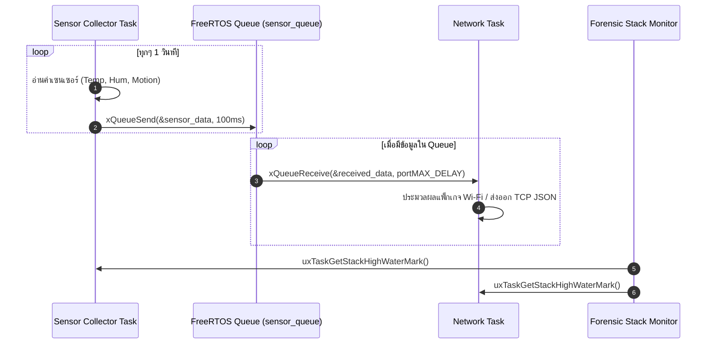

# ใบงานที่ 6.3: การออกแบบ FreeRTOS Task Architecture & Sensor Data Fusion ผ่าน Queue

## 0. กล่าวนำ (Introduction)
ในแอปพลิเคชัน IoT ระดับอุตสาหกรรม โปรแกรมเมอร์จะไม่เขียนโค้ดอ่านค่าเซนเซอร์และการรับส่งข้อมูล Wi-Fi รวมไว้ในฟังก์ชันเดียวกัน เพราะจะทำให้สแตกระบบเครือข่ายชะงัก (Network Latency & Blocking) 

ในใบงานนี้นักศึกษาจะได้ออกแบบสถาปัตยกรรม **FreeRTOS Multi-Tasking** โดยแยกโปรแกรมออกเป็น **Sensor Collector Task** และ **Network Communication Task** แล้วใช้ **FreeRTOS Queue** เป็นสะพานเชื่อมส่งผ่านโครงสร้างข้อมูล `sensor_data_t` อย่างปลอดภัย (Thread-Safe) พร้อมทั้งใช้คำสั่ง Forensic ตรวจวัดหน่วยความจำสแตก `uxTaskGetStackHighWaterMark()`

---

## 1. วัตถุประสงค์ (Objectives)
1. สามารถสร้างและบริหารจัดการ FreeRTOS Tasks บน ESP-IDF ด้วยฟังก์ชัน `xTaskCreate()` ได้
2. สามารถสร้างและใช้งาน FreeRTOS Queue (`xQueueCreate`, `xQueueSend`, `xQueueReceive`) ในการส่งผ่านข้อมูลได้
3. ป้องกันปัญหาการบล็อกระบบเครือข่าย Wi-Fi โดยการแยกงานอ่านเซนเซอร์ออกจาก Network Loop
4. ประเมินการใช้หน่วยความจำสแตกของแต่ละ Task ในสไตล์ Forensic ด้วย `uxTaskGetStackHighWaterMark()`

---

## 2. อุปกรณ์และซอฟต์แวร์ที่ใช้ในการทดลอง (Equipment & Tools)
1. บอร์ดไมโครคอนโทรลเลอร์ ESP32 จำนวน 1 บอร์ด
2. สายเชื่อมต่อ Micro-USB หรือ USB-C จำนวน 1 เส้น
3. โปรแกรม IDE เช่น VS Code พร้อม ESP-IDF Toolchain

---

## 3. สถาปัตยกรรมระบบ (System Architecture & Sequence)



---

## 4. ขั้นตอนการทดลอง (Experimental Procedures)

1. นำซอร์สโค้ดในข้อ 5 ไปวางในไฟล์ `main/main.c` ทำการ Build และ Flash ลงบอร์ด ESP32
2. สังเกต Forensic Log ใน Serial Monitor:
   - ตรวจดูข้อมูลที่ถูกส่งจาก `vSensorTask` เข้าสู่ Queue และถูกรับโดย `vNetworkTask`
   - ตรวจดูค่า **Stack High Water Mark** (ขนาดสแตกคงเหลือ) ของแต่ละ Task
3. ทดลองปรับขนาดสแตกของ `vSensorTask` ใน `xTaskCreate()` จาก `4096` ลดลงเหลือ `1024` สังเกตค่า High Water Mark และวิเคราะห์จุดเสี่ยง Stack Overflow

---

## 5. ซอร์สโค้ดการทดลอง (Complete ESP-IDF Source Code - `main.c`)

```c
#include <stdio.h>
#include <string.h>
#include "freertos/FreeRTOS.h"
#include "freertos/task.h"
#include "freertos/queue.h"
#include "esp_system.h"
#include "esp_log.h"
#include "esp_random.h"

static const char *TAG = "LAB_FREERTOS_QUEUE";

// Sensor Data Structure
typedef struct {
    float temperature;
    float humidity;
    uint32_t light_lux;
    uint32_t timestamp_ms;
} sensor_data_t;

// Queue Handle
static QueueHandle_t xSensorQueue = NULL;

// ------------------------------------------------------------------
// Task 1: Sensor Collector Task (Simulates Reading Hardware Sensors)
// ------------------------------------------------------------------
void vSensorTask(void *pvParameters) {
    sensor_data_t data;
    ESP_LOGI(TAG, "[TASK CREATED]: Sensor Collector Task Started on Core %d", xPortGetCoreID());

    while (1) {
        // 1. Simulate reading sensors
        data.temperature = 25.0f + (esp_random() % 100) / 10.0f;
        data.humidity = 50.0f + (esp_random() % 200) / 10.0f;
        data.light_lux = 200 + (esp_random() % 500);
        data.timestamp_ms = xTaskGetTickCount() * portTICK_PERIOD_MS;

        ESP_LOGI(TAG, "[SENSOR TASK]: Pushing Data -> Temp: %.1f C, Hum: %.1f %%, Lux: %ld",
                 data.temperature, data.humidity, data.light_lux);

        // 2. Send data structure to FreeRTOS Queue
        if (xQueueSend(xSensorQueue, &data, pdMS_TO_TICKS(100)) != pdPASS) {
            ESP_LOGW(TAG, "[QUEUE WARNING]: Queue Full! Failed to push sensor data.");
        }

        // 3. Stack High Water Mark Check
        UBaseType_t hwm = uxTaskGetStackHighWaterMark(NULL);
        ESP_LOGI("FORENSIC_STACK", "  -> SensorTask Stack Remaining: %u words (%u bytes)",
                 hwm, hwm * sizeof(StackType_t));

        vTaskDelay(pdMS_TO_TICKS(1500));
    }
}

// ------------------------------------------------------------------
// Task 2: Network Task (Consumes Data from Queue for Wi-Fi Transmission)
// ------------------------------------------------------------------
void vNetworkTask(void *pvParameters) {
    sensor_data_t rx_data;
    ESP_LOGI(TAG, "[TASK CREATED]: Network Task Started on Core %d", xPortGetCoreID());

    while (1) {
        // Wait indefinitely for data from Queue
        if (xQueueReceive(xSensorQueue, &rx_data, portMAX_DELAY) == pdTRUE) {
            ESP_LOGI(TAG, "=======================================================");
            ESP_LOGI(TAG, "[NETWORK TASK]: Data Received from Queue!");
            ESP_LOGI(TAG, "  -> Timestamp   : %ld ms", rx_data.timestamp_ms);
            ESP_LOGI(TAG, "  -> Temperature : %.2f degC", rx_data.temperature);
            ESP_LOGI(TAG, "  -> Humidity    : %.2f %%", rx_data.humidity);
            ESP_LOGI(TAG, "  -> Light Lux   : %ld lux", rx_data.light_lux);
            ESP_LOGI(TAG, "[NETWORK TASK]: Preparing JSON Packet for Wi-Fi Transmission...");
            ESP_LOGI(TAG, "=======================================================");
        }

        UBaseType_t hwm = uxTaskGetStackHighWaterMark(NULL);
        ESP_LOGI("FORENSIC_STACK", "  -> NetworkTask Stack Remaining: %u words (%u bytes)",
                 hwm, hwm * sizeof(StackType_t));
    }
}

void app_main(void) {
    ESP_LOGI(TAG, "==================================================================");
    ESP_LOGI(TAG, "  Lab 6.3: FreeRTOS Multi-Tasking & Sensor Data Queue Fusion");
    ESP_LOGI(TAG, "==================================================================");

    // Create FreeRTOS Queue for 10 items of sensor_data_t
    xSensorQueue = xQueueCreate(10, sizeof(sensor_data_t));
    if (xSensorQueue == NULL) {
        ESP_LOGE(TAG, "Failed to create FreeRTOS Queue!");
        return;
    }

    // Create Tasks
    xTaskCreate(vSensorTask, "SensorCollectorTask", 3072, NULL, 5, NULL);
    xTaskCreate(vNetworkTask, "NetworkCommTask", 4096, NULL, 4, NULL);
}
```

---

## 6. ตารางบันทึกผลการทดลอง (Experiment Results)

### 6.1 บันทึกข้อมูล Forensic Stack High Water Mark

| ชื่อ FreeRTOS Task | ขนาด Stack ที่กำหนดใน `xTaskCreate` (Bytes) | ค่า High Water Mark ที่อ่านได้ (Words / Bytes) | สถานะความปลอดภัยสแตก |
| :--- | :---: | :---: | :---: |
| **`SensorCollectorTask`** | 3072 | 2028 words / 2028 bytes | ปลอดภัย (Safe) — ค่าคงที่ทุกรอบ ไม่มีแนวโน้มลดลง (ไม่มี stack leak) |
| **`NetworkCommTask`** | 4096 | 3080 words / 3080 bytes | ปลอดภัย (Safe) — ค่าคงที่ทุกรอบ ไม่มีแนวโน้มลดลง (ไม่มี stack leak) |

> **หมายเหตุ:** จาก Serial Log ค่าที่พิมพ์ออกมาในช่อง "words" และ "bytes" เป็นตัวเลขเดียวกัน (เช่น `2028 words (2028 bytes)`) ซึ่งเป็นผลจากรูปแบบการ cast/format string ใน `ESP_LOGI` ของโค้ดตัวอย่าง ไม่ได้หมายความว่า 1 word = 1 byte จริง ค่าที่ควรใช้อ้างอิงเปรียบเทียบคือค่าตัวเลขที่ได้ในแต่ละรอบ (คงที่ตลอดการทดลอง = สแตกไม่มีปัญหาการรั่วไหลหรือใกล้ overflow)

---

## 7. คำถามท้ายการทดลอง (Post-Lab Questions)

1. เหตุใดการใช้ FreeRTOS Queue จึงมีความปลอดภัย (Thread-Safe) มากกว่าการใช้ตัวแปรแบบ Global ในการรับส่งข้อมูลระหว่างสอง Task?**

เพราะ FreeRTOS Queue มีกลไกป้องกัน Race Condition ในตัวเอง (built-in mutual exclusion) โดยตอนที่ Task หนึ่งกำลัง `xQueueSend()` หรือ `xQueueReceive()` ระบบจะ lock การเข้าถึงคิวชั่วคราว (critical section) ทำให้อีก Task หนึ่งไม่สามารถเข้ามาอ่าน/เขียนพร้อมกันได้ ข้อมูลจึงถูกคัดลอก (copy) เข้า-ออกจากคิวแบบสมบูรณ์ทีละชุดเสมอ (atomic operation) ไม่มีโอกาสที่ค่าจะถูกเขียนทับกันครึ่งๆ กลางๆ

ในขณะที่ตัวแปร Global ธรรมดาไม่มีกลไกป้องกันใดๆ หาก Sensor Task กำลังเขียนค่า `temperature` อยู่ แต่ Network Task ดันมาอ่านค่าพร้อมกันพอดี (context switch เกิดขึ้นกลางคัน) อาจได้ข้อมูลที่ไม่สมบูรณ์ (partial update) เช่น ได้ค่า `temperature` ใหม่แต่ `humidity` เก่า ทำให้ข้อมูลไม่สอดคล้องกัน (data corruption) นอกจากนี้ Queue ยังมี buffer ในตัว (สามารถเก็บได้หลายรายการ เช่น 10 รายการในแล็บนี้) ทำให้ Task ผู้ผลิตข้อมูล (Producer) ไม่จำเป็นต้องรอ Task ผู้บริโภคข้อมูล (Consumer) พร้อมเสมอไป ต่างจาก Global variable ที่มีที่เก็บได้แค่ค่าล่าสุดเพียงค่าเดียว

2. ค่า Stack High Water Mark มีประโยชน์อย่างไรในการตรวจวินิจฉัยปัญหาบั๊กในระบบเรียลไทม์ (RTOS)?**

- **ตรวจจับความเสี่ยง Stack Overflow ล่วงหน้า**: ค่า HWM คือปริมาณสแตกที่เหลือน้อยที่สุดตั้งแต่ Task เริ่มทำงาน หากค่านี้ใกล้ 0 แสดงว่า Task เกือบใช้สแตกจนหมด มีความเสี่ยงสูงที่จะเกิด Stack Overflow ซึ่งอาจทำให้ระบบ Crash, ข้อมูลใน Heap หรือ Task อื่นเสียหาย (memory corruption) หรือเกิด Guru Meditation Error บน ESP32
- **ช่วยปรับขนาด Stack ให้เหมาะสม (Right-sizing)**: นักพัฒนาสามารถใช้ค่า HWM เพื่อลดขนาด Stack ของ Task ที่จองไว้มากเกินความจำเป็น เพื่อประหยัด RAM ซึ่งมีจำกัดในระบบ Embedded/RTOS หรือเพิ่มขนาด Stack ของ Task ที่มีความเสี่ยง
- **ใช้ Debug บั๊กที่เกิดแบบไม่แน่นอน (Intermittent Bugs)**: บั๊กที่เกิดจาก Stack Overflow มักแสดงอาการแปลกๆ ไม่คงที่ (เช่น ค่าตัวแปรเพี้ยน, ระบบ Reset เอง) การมอนิเตอร์ HWM อย่างสม่ำเสมอช่วยให้ระบุสาเหตุที่แท้จริงได้ง่ายกว่าการเดา
- **ตรวจสอบผลกระทบจากการเรียกใช้ฟังก์ชันซ้อนลึก (Deep Recursion) หรือตัวแปร Local ขนาดใหญ่**: ฟังก์ชันที่มีการประกาศ Array/Struct ขนาดใหญ่ไว้ใน Stack (local variable) จะทำให้ HWM ลดฮวบทันที ช่วยให้หาจุดที่ใช้สแตกเปลืองได้

3. หาก vSensorTask ส่งข้อมูลเร็วมาก (ทุก 10ms) แต่ vNetworkTask ส่งออก Wi-Fi ได้ช้า (500ms) จะเกิดอะไรกับ Queue และระบบจะรับมืออย่างไร?**

**สิ่งที่จะเกิดขึ้น:**
- อัตราการผลิตข้อมูล (Producer Rate) เร็วกว่าอัตราการบริโภค (Consumer Rate) มาก (10ms เทียบกับ 500ms คือต่างกันถึง 50 เท่า) ทำให้ **Queue เต็มอย่างรวดเร็ว** (เต็มภายในเวลาประมาณ 100ms หากคิวมีขนาด 10 ช่อง)
- เมื่อ Queue เต็ม การเรียก `xQueueSend(&data, pdMS_TO_TICKS(100))` จะรอ (block) จนครบ timeout 100ms แล้ว **คืนค่า `pdFAIL`** ซึ่งในโค้ดตัวอย่างจะเข้าเงื่อนไข `ESP_LOGW` แสดงข้อความ "Queue Full! Failed to push sensor data."
- ผลลัพธ์คือ **ข้อมูลเซนเซอร์บางชุดสูญหาย (Data Loss)** เพราะ Sensor Task ไม่สามารถส่งข้อมูลใหม่เข้าคิวได้ทันเวลา ระบบจะข้ามข้อมูลชุดนั้นไปเลย ไม่มีการเก็บสะสมไว้รอ
- หากปล่อยไว้นานๆ Sensor Task จะเสียเวลาไปกับการรอ (block) ที่ `xQueueSend` บ่อยครั้ง ทำให้ประสิทธิภาพโดยรวมของ Task ลดลงด้วย

**แนวทางรับมือ:**
1. **เพิ่มขนาด Queue (Queue Length)**: ปรับ `xQueueCreate(10, ...)` ให้ใหญ่ขึ้น เพื่อรองรับ burst ของข้อมูลได้มากขึ้นชั่วคราว แต่เป็นการแก้ปัญหาที่ปลายเหตุ เพราะสุดท้ายก็จะเต็มอยู่ดีถ้าอัตราต่างกันมากและต่อเนื่องยาวนาน
2. **ลดอัตราการส่งข้อมูลของ Sensor Task ให้สมดุลกับ Network Task**: เช่น ปรับ `vTaskDelay` ให้ใกล้เคียงกับความเร็วที่ Network Task รับไหว หรือใช้ Timer/Rate limiting
3. **ใช้ Queue Overwrite/แทนที่ข้อมูลเก่า**: สำหรับข้อมูลเซนเซอร์ที่สนใจแค่ค่าล่าสุด (ไม่จำเป็นต้องเก็บทุกค่า) สามารถใช้ `xQueueOverwrite()` ร่วมกับ Queue ขนาด 1 ช่อง เพื่อให้ค่าล่าสุดเขียนทับค่าเก่าเสมอ แทนที่จะ Fail
4. **เพิ่มความเร็วฝั่ง Network Task**: ปรับปรุงโค้ดการส่ง Wi-Fi ให้เร็วขึ้น เช่น Batch หลายๆ ค่าเข้าไปในแพ็กเกจ JSON เดียวแล้วส่งทีเดียว (Data Aggregation) แทนที่จะส่งทีละค่า
5. **ทำ Data Aggregation/Averaging ก่อนส่งเข้า Queue**: เช่น เก็บค่าเฉลี่ยของ 50 ค่าที่อ่านได้ใน 500ms แล้วส่งเข้า Queue เพียง 1 ครั้ง ลดจำนวนรายการที่ต้องส่งจริง และยังช่วยลด Noise ของข้อมูลเซนเซอร์ได้ด้วย
