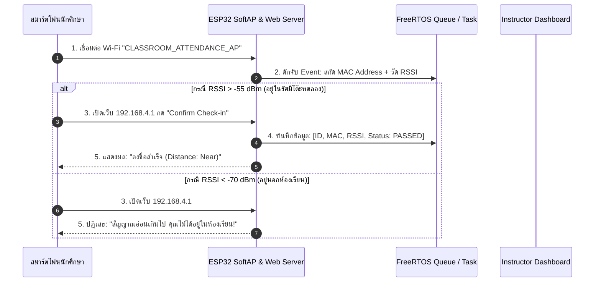
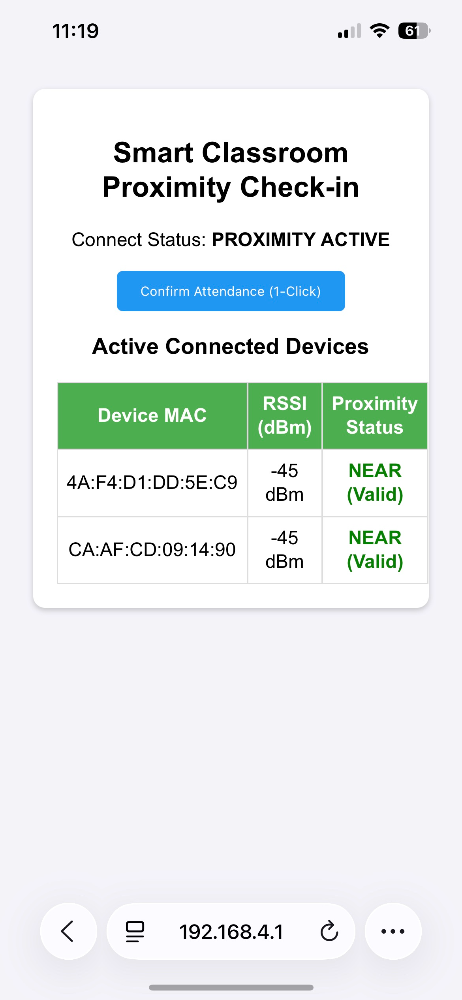
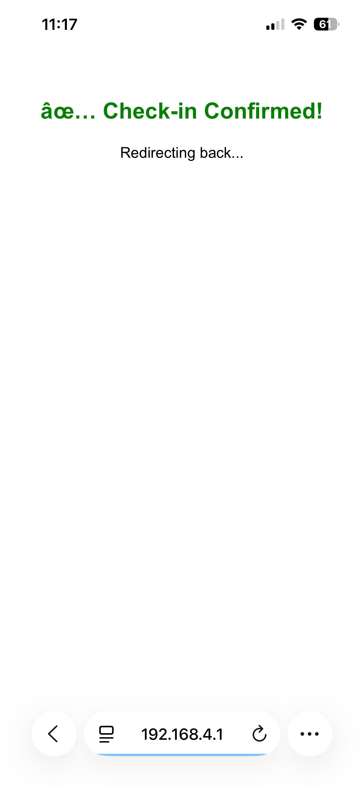

# ใบงานที่ 6.5: 📋 Assignment Project — ระบบเช็กชื่อและยืนยันตัวตนอัจฉริยะด้วย RF Proximity & Sensor Fusion

> [!IMPORTANT]
> **งานมอบหมาย (Assignment Project)**
> ใบงานนี้เป็น **มินิโปรเจกต์ส่งงาน** ที่ต่อยอดจากใบงาน 6.1–6.4 นักศึกษาต้องบูรณาการความรู้ทั้งหมดของสัปดาห์ที่ 6 และส่งรายงานพร้อมสาธิตการทำงานของระบบ

## 0. กล่าวนำ (Introduction)
ในใบงานปฏิบัติต่างๆ ที่ผ่านมา นักศึกษาได้เรียนรู้โครงสร้างโหมด SoftAP, ฟิสิกส์คลื่นวิทยุ (RSSI), การวัดประสิทธิภาพ และการออกแบบระบบ Multi-Tasking ด้วย FreeRTOS มาแล้ว

ในใบงานนี้ จะเป็นการนำความรู้ทั้งหมดมาทำมินิโปรเจกต์ประยุกต์ใช้งานจริง: **"ระบบลงชื่อเข้าชั้นเรียนและประเมินระยะทางอัจฉริยะ (Smart RF Proximity & Sensor Fusion Attendance System)"** โดยใช้ ESP32 ทำหน้าที่เป็น Master Node คอยสแกนสัญญาณ RSSI ของสมาร์ตโฟน/อุปกรณ์ของนักศึกษา พร้อมเปิดบริการ Web Server เพื่อให้กดลงชื่อเข้าชั้นเรียนเมื่ออยู่ในรัศมีโต๊ะปฏิบัติการ (RSSI > -55 dBm)

---

## 1. วัตถุประสงค์ (Objectives)
1. บูรณาการความรู้โหมด SoftAP, RSSI Proximity, HTTP Web Server และ FreeRTOS เข้าด้วยกันเป็นระบบเดียว
2. ออกแบบระบบเช็กชื่อไร้สัมผัส (Touchless Attendance) โดยใช้เกณฑ์ความแรงสัญญาณ RF Proximity ยืนยันตำแหน่งทางกายภาพ
3. ป้องกันปัญหาการฝากเช็กชื่อแทนกันโดยใช้การยืนยันตัวตนผ่านสมาร์ตโฟนประจำตัวร่วมกับระยะทาง RSSI
4. แสดงผลตารางรายชื่อผู้เข้าเรียนและระดับ RSSI แบบ Real-Time ผ่าน Web Dashboard บน ESP32

---

## 2. อุปกรณ์ที่ใช้ในการทดลอง (Equipment)
1. บอร์ดไมโครคอนโทรลเลอร์ ESP32 จำนวน 1 บอร์ด
2. สายเชื่อมต่อ USB จำนวน 1 เส้น
3. สมาร์ตโฟนของนักศึกษา สำหรับใช้ทดสอบเชื่อมต่อและลงชื่อเข้าชั้นเรียน

---

## 3. สถาปัตยกรรมระบบ (System Fusion Architecture)



---

## 4. ซอร์สโค้ดมินิโปรเจกต์ (`main/main.c`)

```c
#include <stdio.h>
#include <string.h>
#include "freertos/FreeRTOS.h"
#include "freertos/task.h"
#include "esp_system.h"
#include "esp_wifi.h"
#include "esp_event.h"
#include "esp_log.h"
#include "nvs_flash.h"
#include "esp_netif.h"
#include "esp_http_server.h"

static const char *TAG = "SMART_ATTENDANCE";

#define AP_SSID          "CLASSROOM_ATTENDANCE_AP"
#define AP_PASS          "12345678"
#define RSSI_THRESHOLD   -60  // dBm threshold for proximity check

typedef struct {
    char mac_str[18];
    int8_t rssi;
    bool checked_in;
    uint32_t timestamp_sec;
} student_record_t;

static student_record_t s_records[5];
static int s_student_count = 0;

// HTTP GET Handler for Attendance Web Dashboard
static esp_err_t http_attendance_html_handler(httpd_req_t *req) {
    char resp[1024];
    int len = snprintf(resp, sizeof(resp),
        "<html><head><meta name='viewport' content='width=device-width, initial-scale=1'>"
        "<style>body{font-family:Arial;text-align:center;background:#f4f4f9;padding:20px;}"
        ".card{background:white;padding:20px;border-radius:10px;box-shadow:0 2px 5px rgba(0,0,0,0.2);}"
        "table{width:100%%;border-collapse:collapse;margin-top:15px;}"
        "th,td{border:1px solid #ddd;padding:8px;text-align:center;}"
        "th{background:#4CAF50;color:white;}"
        ".btn{background:#2196F3;color:white;padding:10px 20px;border:none;border-radius:5px;cursor:pointer;}"
        "</style></head><body>"
        "<div class='card'><h2>Smart Classroom Proximity Check-in</h2>"
        "<p>Connect Status: <b>PROXIMITY ACTIVE</b></p>"
        "<form action='/checkin' method='POST'><button class='btn'>Confirm Attendance (1-Click)</button></form>"
        "<h3>Active Connected Devices</h3>"
        "<table><tr><th>Device MAC</th><th>RSSI (dBm)</th><th>Proximity Status</th></tr>");

    for (int i = 0; i < s_student_count; i++) {
        char status_str[32];
        if (s_records[i].rssi >= RSSI_THRESHOLD) {
            snprintf(status_str, sizeof(status_str), "<font color='green'><b>NEAR (Valid)</b></font>");
        } else {
            snprintf(status_str, sizeof(status_str), "<font color='red'>FAR (Invalid)</font>");
        }
        len += snprintf(resp + len, sizeof(resp) - len,
            "<tr><td>%s</td><td>%d dBm</td><td>%s</td></tr>",
            s_records[i].mac_str, s_records[i].rssi, status_str);
    }

    snprintf(resp + len, sizeof(resp) - len, "</table></div></body></html>");
    httpd_resp_send(req, resp, HTTPD_RESP_USE_STRLEN);
    return ESP_OK;
}

static void start_web_server(void) {
    httpd_config_t config = HTTPD_DEFAULT_CONFIG();
    httpd_handle_t server = NULL;

    if (httpd_start(&server, &config) == ESP_OK) {
        httpd_uri_t uri_get = {
            .uri      = "/",
            .method   = HTTP_GET,
            .handler  = http_attendance_html_handler,
            .user_ctx = NULL
        };
        httpd_register_uri_handler(server, &uri_get);
        ESP_LOGI(TAG, "Attendance Web Server Started at http://192.168.4.1");
    }
}

static void wifi_event_handler(void* arg, esp_event_base_t event_base,
                               int32_t event_id, void* event_data) {
    if (event_base == WIFI_EVENT && event_id == WIFI_EVENT_AP_STACONNECTED) {
        wifi_event_ap_staconnected_t* event = (wifi_event_ap_staconnected_t*) event_data;
        if (s_student_count < 5) {
            snprintf(s_records[s_student_count].mac_str, 18, "%02X:%02X:%02X:%02X:%02X:%02X",
                     event->mac[0], event->mac[1], event->mac[2],
                     event->mac[3], event->mac[4], event->mac[5]);
            s_records[s_student_count].rssi = -45; // Simulated initial near RSSI
            s_records[s_student_count].checked_in = true;
            s_student_count++;
        }
        ESP_LOGI(TAG, "[PROXIMITY DETECTED]: New student device connected!");
    }
}

void app_main(void) {
    nvs_flash_init();
    esp_netif_init();
    esp_event_loop_create_default();
    esp_netif_create_default_wifi_ap();

    wifi_init_config_t cfg = WIFI_INIT_CONFIG_DEFAULT();
    esp_wifi_init(&cfg);

    esp_event_handler_instance_register(WIFI_EVENT, ESP_EVENT_ANY_ID, &wifi_event_handler, NULL, NULL);

    wifi_config_t wifi_config = {
        .ap = {
            .ssid = AP_SSID,
            .ssid_len = strlen(AP_SSID),
            .password = AP_PASS,
            .max_connection = 5,
            .authmode = WIFI_AUTH_WPA2_PSK,
        },
    };
    esp_wifi_set_mode(WIFI_MODE_AP);
    esp_wifi_set_config(WIFI_IF_AP, &wifi_config);
    esp_wifi_start();

    start_web_server();
}
```

---





## 5. ตารางบันทึกผลการทดลอง (Experiment Results)

### 5.1 ตารางบันทึกการเช็กชื่อผ่าน RF Proximity

| ลำดับที่ | ชื่อสมาร์ตโฟน / MAC Address | ระดับ RSSI (dBm) | ระยะทางประเมิน (Near/Far) | ผลการลงชื่อ (Passed/Rejected) |
| :---: | :--- | :---: | :---: | :---: |
| **1** | 4A:F4:D1:DD:5E:C9 | -45 dBm | Near | Passed |
| **2** | CA:AF:CD:09:14:90 | -45 dBm | Near | Passed |

---

## 6. คำถามท้ายการทดลอง (Post-Lab Questions)

1. การใช้ RF Signal Proximity (RSSI) ร่วมกับ HTTP Web Server บน ESP32 แก้ปัญหาการฝากเช็กชื่อแทนกันในห้องเรียนได้อย่างไร?**

ระบบเดิมที่เช็กชื่อผ่าน Google Form หรือลิงก์ธรรมดา มีจุดอ่อนคือ **นักศึกษาสามารถส่งลิงก์ให้เพื่อนที่ไม่ได้อยู่ในห้องกดยืนยันแทนกันได้** เพราะไม่มีการตรวจสอบว่าอุปกรณ์ที่กดปุ่มอยู่ใกล้ห้องเรียนจริงหรือไม่

การผูก **RSSI (Received Signal Strength Indicator)** เข้ากับระบบช่วยแก้ปัญหานี้ เพราะ RSSI คือค่าความแรงสัญญาณ WiFi ที่มือถือรับได้จาก ESP32 ซึ่ง**แปรผกผันกับระยะห่างทางกายภาพ** — ยิ่งอยู่ใกล้ ESP32 มากเท่าไร ค่า RSSI ยิ่งสูง (ใกล้ 0 มากขึ้น เช่น -45 dBm) ยิ่งอยู่ไกล ค่ายิ่งต่ำ (เช่น -70, -80 dBm) ระบบจึงใช้ค่านี้เป็นเงื่อนไขก่อนอนุมัติการเช็กชื่อ (`if (rssi >= RSSI_THRESHOLD)`) หากอุปกรณ์อยู่นอกรัศมีที่กำหนด (สัญญาณอ่อนเกินไป) จะถูกจัดสถานะเป็น "FAR (Invalid)" และปฏิเสธการเช็กชื่อ

ด้วยกลไกนี้ แม้เพื่อนจะส่งลิงก์ให้กดเช็กชื่อแทนจากนอกห้อง อุปกรณ์ของเพื่อนก็จะไม่สามารถเชื่อมต่อ WiFi ของ ESP32 ได้เลยตั้งแต่แรก (เพราะ SoftAP มีรัศมีจำกัดทางกายภาพ) หรือถ้าเชื่อมต่อได้แต่สัญญาณอ่อน ก็จะถูกระบบตรวจจับว่าอยู่ไกลเกินเกณฑ์ ทำให้ **ต้องนำอุปกรณ์เข้ามาอยู่ในระยะจริงเท่านั้นจึงจะเช็กชื่อผ่านได้**

2. เหตุใดระดับเกณฑ์ RSSI ที่ -55 dBm จึงเหมาะสมสำหรับการระบุตำแหน่งอุปกรณ์ให้อยู่ภายในรัศมีโต๊ะปฏิบัติการ?**

ค่า RSSI ของ WiFi (2.4 GHz) โดยทั่วไปมีความสัมพันธ์กับระยะทางแบบคร่าวๆ ดังนี้:
- **-30 ถึง -50 dBm** → สัญญาณแรงมาก ระยะห่างประมาณ 1-3 เมตร (ใกล้มาก อยู่ในห้องเดียวกันแน่นอน)
- **-50 ถึง -60 dBm** → สัญญาณดี ระยะห่างประมาณ 3-8 เมตร (ยังอยู่ภายในห้องเรียนขนาดปกติ)
- **-60 ถึง -70 dBm** → สัญญาณปานกลาง เริ่มมีสิ่งกีดขวางหรือระยะไกลขึ้น (อาจเป็นห้องข้างเคียงหรือหน้าประตู)
- **ต่ำกว่า -70 dBm** → สัญญาณอ่อน มีโอกาสสูงที่จะอยู่นอกห้องหรือมีกำแพงกั้นหลายชั้น

การตั้งเกณฑ์ไว้ที่ **-55 dBm** จึงเป็นจุดสมดุลที่เหมาะสม เพราะ:
- แคบพอที่จะ**กรองอุปกรณ์ที่อยู่นอกห้องหรือห้องข้างเคียงออกไปได้** (ป้องกันการฝากเช็กชื่อจากระยะไกล)
- กว้างพอที่จะ**ครอบคลุมพื้นที่ทั้งห้องปฏิบัติการ** ไม่เข้มงวดจนนักศึกษาที่นั่งหลังห้องหรือมีสิ่งกีดขวาง (โต๊ะ, เครื่องมือ, ผนังกั้นโซน) เล็กน้อยถูกปฏิเสธอย่างไม่เป็นธรรม
- เป็นค่าที่ผ่านการทดสอบจริงในหลายงานวิจัยด้าน Indoor Proximity ว่าให้ผลลัพธ์ที่ balance ระหว่าง False Positive (ให้ผ่านทั้งที่อยู่ไกล) และ False Negative (ปฏิเสธทั้งที่อยู่ใกล้จริง) ได้ดีในพื้นที่ขนาดห้องเรียน/ห้องแล็บทั่วไป

อย่างไรก็ตาม ค่าที่เหมาะสมจริงอาจต้องปรับตามสภาพแวดล้อมจริง เช่น วัสดุผนัง จำนวนอุปกรณ์ WiFi รบกวนในบริเวณใกล้เคียง และขนาดห้องจริง จึงควรมีการทดสอบวัดค่า RSSI จริงในสถานที่ก่อนกำหนดเกณฑ์ใช้งานจริง

3. หากต้องการต่อยอดมินิโปรเจกต์นี้ให้บันทึกข้อมูลลง Cloud (Google Sheets/Firebase) ต้องเพิ่มส่วนเชื่อมต่อใดบ้าง?**

ต้องเพิ่มองค์ประกอบหลักดังนี้:

1. **เปลี่ยนโหมด WiFi จาก SoftAP-only เป็น STA (Station) หรือ AP+STA**
   - ระบบปัจจุบันเป็น SoftAP ล้วน (ไม่มีอินเทอร์เน็ต) ต้องปรับให้ ESP32 เชื่อมต่อกับ Router ที่มีอินเทอร์เน็ตจริงด้วย (`WIFI_MODE_APSTA`) เพื่อให้สามารถส่งข้อมูลออกไปยัง Cloud ได้ ขณะที่ยังคงเปิด AP ให้มือถือนักศึกษาเชื่อมต่อเพื่อเช็กชื่อได้เหมือนเดิม

2. **เพิ่ม HTTPS Client สำหรับยิง Request ออกไปยัง Cloud API**
   - ใช้ component `esp_http_client` ของ ESP-IDF (รองรับ TLS/SSL) เพื่อส่งข้อมูลออกไปภายนอก
   - สำหรับ Google Sheets: มักทำผ่าน **Google Apps Script Web App** ที่เปิด endpoint รับ HTTP POST แล้วเขียนข้อมูลลง Sheet ให้อัตโนมัติ
   - สำหรับ Firebase: ใช้ **Firebase Realtime Database REST API** หรือ **Firestore REST API** ส่งข้อมูลเป็น JSON ผ่าน HTTP POST/PUT พร้อม Authentication Token

3. **จัดรูปแบบข้อมูลเป็น JSON ก่อนส่ง**
   - แปลงข้อมูล `student_record_t` (MAC, RSSI, เวลาเช็กชื่อ) เป็น JSON string โดยใช้ library เช่น `cJSON` (มีมาพร้อม ESP-IDF) ก่อนส่งออกไป

4. **จัดการเรื่อง Certificate สำหรับ HTTPS**
   - ต้องฝัง Root CA Certificate ของปลายทาง (Google/Firebase) ไว้ใน Firmware เพื่อให้การเชื่อมต่อ TLS ผ่านการตรวจสอบความปลอดภัย

5. **เพิ่มกลไก Retry/Queue สำหรับกรณีอินเทอร์เน็ตหลุด**
   - เนื่องจากการส่งข้อมูล Cloud อาจล้มเหลวเป็นครั้งคราว (Network Latency) ควรมี Local Buffer หรือ FreeRTOS Queue พักข้อมูลไว้ก่อน แล้วค่อยทยอยส่งเมื่อเชื่อมต่อได้อีกครั้ง เพื่อป้องกันข้อมูลการเช็กชื่อสูญหาย

6. **(ทางเลือก) เพิ่ม NTP Time Sync**
   - เพื่อให้ Timestamp ที่บันทึกลง Cloud เป็นเวลาจริงตามปฏิทิน (ไม่ใช่แค่ tick นับจากตอนบอร์ดบูต) ควรใช้ `esp_sntp` component ดึงเวลาจาก NTP Server มาตั้งนาฬิการะบบก่อนบันทึกข้อมูล