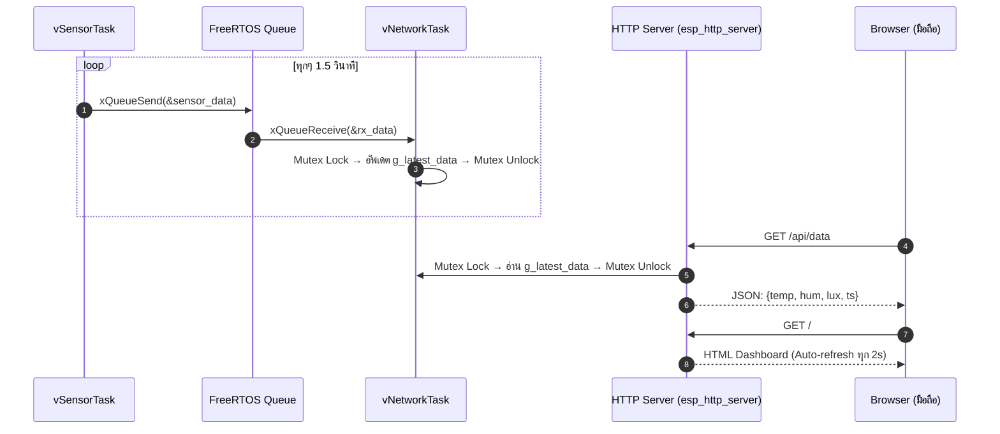
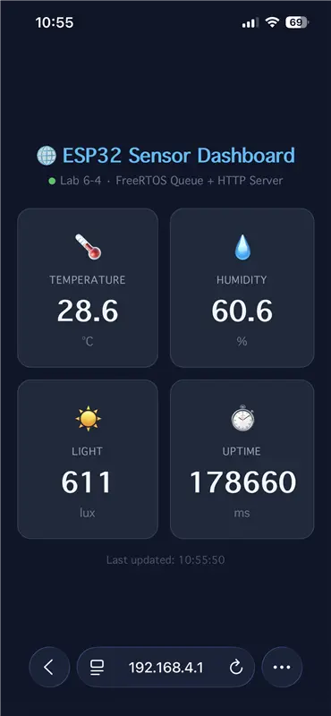
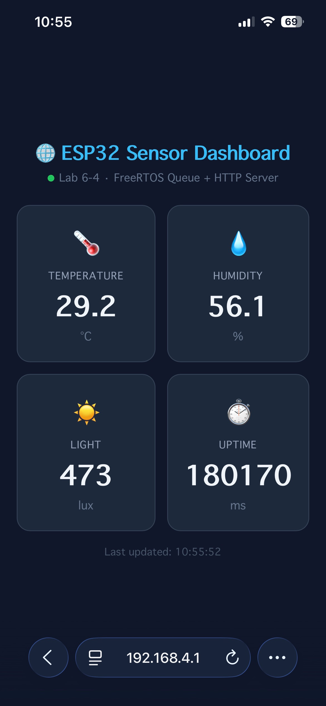
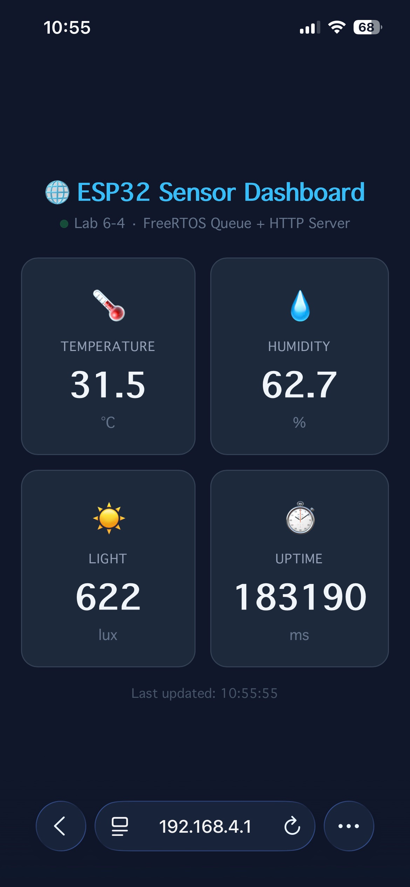

# ใบงานที่ 6.4: IoT Sensor Dashboard — แสดงผลค่าเซนเซอร์แบบ Real-Time ผ่าน Web Browser บนมือถือ

## 0. กล่าวนำ (Introduction)

ในใบงาน 6.3 นักศึกษาได้สร้างระบบ FreeRTOS Multi-Tasking ที่ `vSensorTask` อ่านค่าเซนเซอร์ → ส่งผ่าน Queue → `vNetworkTask` รับและ "เตรียม JSON" แต่ข้อมูลยังไม่ได้ออกไปสู่โลกภายนอก

ในใบงานนี้ นักศึกษาจะ**ต่อยอดโค้ด Lab 6-3 โดยตรง** โดยเพิ่ม
1. **ESP32 SoftAP** — ให้มือถือเชื่อมต่อ Wi-Fi ตรงโดยไม่ต้อง Router
2. **HTTP Web Server (`esp_http_server`)** — เปิด Endpoint 2 ตัว
   - `GET /` → หน้า Dashboard HTML Auto-refresh ทุก 2 วินาที
   - `GET /api/data` → ส่งค่า JSON ล่าสุดให้ Browser

---

## 1. วัตถุประสงค์ (Objectives)

1. เชื่อมโยง FreeRTOS Queue Pipeline กับ HTTP Web Server เพื่อส่งข้อมูลออกสู่ Browser จริง
2. ใช้งาน `esp_http_server` component ของ ESP-IDF ในการสร้าง REST API Endpoint บน ESP32
3. ออกแบบ ESP32 ให้ทำงานเป็น **SoftAP + HTTP Server** พร้อมกัน
4. เข้าใจการใช้ `SemaphoreHandle_t` (Mutex) เพื่อป้องกัน Race Condition เมื่อ HTTP Handler และ FreeRTOS Task แชร์ข้อมูลร่วมกัน

---

## 2. อุปกรณ์และซอฟต์แวร์ที่ใช้ในการทดลอง (Equipment & Tools)

1. บอร์ดไมโครคอนโทรลเลอร์ ESP32 จำนวน 1 บอร์ด
2. สายเชื่อมต่อ USB จำนวน 1 เส้น
3. สมาร์ตโฟนหรือ PC (สำหรับเปิด Browser ดู Dashboard)

---

## 3. สถาปัตยกรรมระบบ (System Architecture)



---

## 4. แนวคิดสำคัญ: Mutex ป้องกัน Race Condition

```
vNetworkTask                    HTTP GET Handler
─────────────────────────       ─────────────────────────
xSemaphoreTake(mutex)           xSemaphoreTake(mutex)
  g_latest_data = rx_data;         read g_latest_data
xSemaphoreGive(mutex)           xSemaphoreGive(mutex)
```

> [!WARNING]
> หากไม่ใช้ Mutex: HTTP Handler อาจอ่านข้อมูลขณะที่ `vNetworkTask` กำลังเขียนอยู่ ทำให้ได้ค่าที่ไม่สมบูรณ์ (Torn Read)

---

## 5. ซอร์สโค้ดการทดลอง (`main/main.c`)

ดูใน `ESP32_Project/Lab6-4-IoT-Sensor-Dashboard/main/main.c`

---

## 6. ขั้นตอนการทดลอง (Experimental Procedures)

1. Build และ Flash โค้ดลงบอร์ด ESP32
2. เปิด Serial Monitor ดู SSID และยืนยัน `[HTTP SERVER]: Started`
3. ใช้มือถือ **เชื่อมต่อ Wi-Fi ชื่อ `MY_ESP32_SENSOR_AP`** (Password: `12345678`)
4. เปิด Browser บนมือถือ แล้วไปที่ `http://192.168.4.1`
5. ควรเห็นหน้า Dashboard แสดง Temperature / Humidity / Light Lux และ Auto-refresh ทุก 2 วินาที
6. ทดสอบ JSON API โดยเปิด `http://192.168.4.1/api/data` ดู Raw JSON

ตัวอย่างหน้า browser


---

## 7. ตารางบันทึกผลการทดลอง (Experiment Results)

### 7.1 บันทึกข้อมูลจาก Dashboard

| ครั้งที่ | Temperature (°C) | Humidity (%) | Light Lux | Timestamp (ms) |
| :------: | :--------------: | :----------: | :-------: | :------------: |
|  **1**   |        28.6      |     60.6     |    611    |     178660      |
|  **2**   |        29.2      |     56.1     |    473    |     180170      |
|  **3**   |        31.5      |     62.7     |    622    |     183190      |






### 7.2 ทดสอบ JSON API (`/api/data`)

บันทึก Raw JSON Response จาก Browser:

```json
{"temperature":30.60,"humidity":65.90,"light_lux":282,"timestamp_ms":106180}
```

---

## 8. คำถามท้ายการทดลอง (Post-Lab Questions)

1. เหตุใดจึงต้องใช้ Mutex ในการป้องกันการเข้าถึงตัวแปร `g_latest_data` ร่วมกันระหว่าง `vNetworkTask` และ HTTP Handler? ถ้าไม่ใช้จะเกิดอะไรขึ้น?**

ต้องใช้ Mutex เพราะ `g_latest_data` เป็น **Shared Resource** ที่ถูกเข้าถึงจากสอง Context การทำงานที่แตกต่างกันพร้อมกันได้ (concurrent access) คือ:
- `vNetworkTask` — เขียนข้อมูลใหม่ลงตัวแปรทุกครั้งที่รับข้อมูลจาก Queue (ทุก ~1.5 วินาที)
- HTTP GET Handler ของ `/api/data` — อ่านข้อมูลจากตัวแปรนี้ทุกครั้งที่ Browser ยิง request เข้ามา (ซึ่งอาจเกิดขึ้นได้ทุกเวลา ไม่สัมพันธ์กับจังหวะของ `vNetworkTask` เลย)

เนื่องจากตัวแปร `g_latest_data` เป็น struct ที่มีหลาย field (temperature, humidity, light_lux, timestamp) การเขียนค่าจึงไม่ได้เกิดขึ้นในคำสั่งเดียว (ไม่ atomic) หากไม่มี Mutex ป้องกัน อาจเกิด **Race Condition / Torn Read** ได้ เช่น:
- `vNetworkTask` กำลังเขียนค่า `temperature` ใหม่เสร็จแล้ว แต่ยังไม่ทันเขียน `humidity` — ในจังหวะนั้นพอดี HTTP Handler เข้ามาอ่านค่า จะได้ temperature ใหม่คู่กับ humidity เก่า ทำให้ข้อมูลไม่สอดคล้องกัน (inconsistent data)
- ในกรณีที่เลวร้ายกว่านั้น หากมีการเขียน/อ่านข้อมูลประเภทที่ compiler/hardware ไม่รับประกันความเป็น atomic (เช่น float หรือ multi-byte value บางสถาปัตยกรรม) อาจได้ค่าที่เป็นขยะ (garbage value) ผสมกันระหว่างค่าเก่ากับค่าใหม่ไปเลย

การใช้ `xSemaphoreTake(mutex, ...)` ก่อนเขียน/อ่าน และ `xSemaphoreGive(mutex)` หลังทำเสร็จ จะบังคับให้การเข้าถึง `g_latest_data` เกิดขึ้นทีละฝ่ายเท่านั้น (mutual exclusion) รับประกันว่าข้อมูลที่อ่านได้จะสมบูรณ์และถูกต้องเสมอ (consistent snapshot) ไม่ว่า HTTP request จะยิงเข้ามาจังหวะไหนก็ตาม

2. `esp_http_server` รัน Handler บน Thread ใด — เป็น Thread เดียวกับ FreeRTOS Task ของเราหรือไม่?**

ไม่ใช่ Thread เดียวกัน — `esp_http_server` component ของ ESP-IDF จะสร้าง **FreeRTOS Task แยกต่างหากของตัวเอง** ขึ้นมาโดยอัตโนมัติเมื่อเรียก `httpd_start()` (ค่าเริ่มต้นมักตั้งชื่อ task ประมาณ `httpd` หรือกำหนดผ่าน `httpd_config_t`) โดย Task นี้ทำหน้าที่ฟัง Socket บน Port 80 และเรียก Handler function ที่เรา register ไว้ (เช่น handler ของ `/` และ `/api/data`) เมื่อมี Client (Browser) ส่ง Request เข้ามา

เพราะฉะนั้นในระบบนี้จึงมี Task ทำงานคู่ขนานกันอย่างน้อย 3 Task คือ `vSensorTask`, `vNetworkTask`, และ Task ภายในของ `esp_http_server` — ทั้งสาม Task ทำงานอิสระจากกัน ถูกสลับกันทำงานโดย FreeRTOS Scheduler ตามลำดับความสำคัญ (priority) และจังหวะเวลา นี่คือเหตุผลสำคัญที่ทำให้ **ต้องใช้ Mutex** ป้องกันตามคำตอบข้อ 1 เพราะ HTTP Handler ไม่ได้รันอยู่ใน Task เดียวกับ `vNetworkTask` การเข้าถึงตัวแปรร่วมจึงเกิด Race Condition ได้จริงตามหลักการ Concurrent Programming

3. การที่ Dashboard ใช้ `<meta http-equiv="refresh" content="2">` แทนที่จะใช้ JavaScript `fetch()` มีข้อดีและข้อเสียอย่างไร?**

**ข้อดีของ Meta Refresh:**
- **เรียบง่ายมาก** ไม่ต้องเขียน JavaScript เลย ใช้ได้แม้ Browser จะปิด JavaScript ไว้ หรือเป็นอุปกรณ์รุ่นเก่าที่รองรับ JS จำกัด
- **ใช้ทรัพยากรฝั่ง ESP32 น้อย** เพราะไม่ต้องเปิด Endpoint หรือจัดการ Response แบบ Asynchronous ที่ซับซ้อน ตัว handler ของ `/` ก็ส่ง HTML คงที่พร้อม meta tag กลับไปตรงๆ
- **เข้ากันได้กับ Browser ทุกรุ่น (Compatibility สูง)** ไม่ต้องกังวลเรื่อง CORS หรือ API ของ JavaScript ที่อาจไม่รองรับในบาง Browser รุ่นเก่า
- โค้ดฝั่ง Client ทำความเข้าใจง่าย เหมาะกับงานสาธิต/การศึกษา

**ข้อเสียของ Meta Refresh:**
- **โหลดหน้าใหม่ทั้งหน้า (Full Page Reload)** ทุกครั้งที่ refresh ทำให้หน้าจอกระพริบ (flicker) เห็นได้ชัดโดยเฉพาะบนมือถือ ประสบการณ์ผู้ใช้ (UX) ไม่ลื่นไหล
- **สิ้นเปลือง Bandwidth และทรัพยากรมากกว่า** เพราะต้องส่ง HTML ทั้งหน้า (Header, CSS, Layout ทั้งหมด) ซ้ำทุก 2 วินาที ทั้งที่จริงๆ มีแค่ตัวเลขไม่กี่ค่าที่เปลี่ยน ต่างจาก `fetch()` ที่ดึงแค่ JSON ก้อนเล็กๆ จาก `/api/data`
- **ควบคุมจังหวะ/เงื่อนไขได้จำกัด** ไม่สามารถหยุด refresh ชั่วคราว, ปรับ interval แบบ dynamic, หรือแสดง Loading state/Error handling ได้อย่างละเอียดเหมือนเขียนด้วย JavaScript
- **เสีย State ของหน้าเว็บ** เช่น ตำแหน่ง scroll, ค่าที่กรอกในฟอร์ม (ถ้ามี) จะรีเซ็ตทุกครั้งที่โหลดหน้าใหม่
- ปรับแต่ง UI แบบ Interactive (เช่น กราฟ real-time, Animation, sound effect) ไม่ได้เลย เพราะต้องพึ่ง JavaScript เท่านั้น

โดยสรุป Meta Refresh เหมาะกับงานสาธิตหรือระบบง่ายๆ ที่เน้นความเรียบง่ายและใช้ทรัพยากรฝั่ง Server น้อย ส่วน `fetch()` เหมาะกับ Dashboard ที่ต้องการ UX ที่ลื่นไหลกว่าและมีการอัปเดตข้อมูลแบบ real-time จริงจัง

---

## 9. ความรู้เพิ่มเติม: ESP-IDF `esp_http_server` API

| ฟังก์ชัน                                   | ความหมาย                                     |
| :----------------------------------------- | :------------------------------------------- |
| `httpd_start(&server, &config)`            | เริ่มต้น HTTP Server (เปิด Port 80)          |
| `httpd_register_uri_handler(server, &uri)` | ลงทะเบียน Handler สำหรับ URL path            |
| `httpd_resp_send(req, buf, len)`           | ส่ง Response กลับไปยัง Browser               |
| `httpd_resp_set_type(req, type)`           | กำหนด Content-Type (เช่น `application/json`) |
| `xSemaphoreCreateMutex()`                  | สร้าง Mutex สำหรับป้องกัน Race Condition     |
| `xSemaphoreTake(mutex, ticks)`             | Lock Mutex ก่อนอ่าน/เขียน Shared Data        |
| `xSemaphoreGive(mutex)`                    | Unlock Mutex หลังเสร็จ                       |
